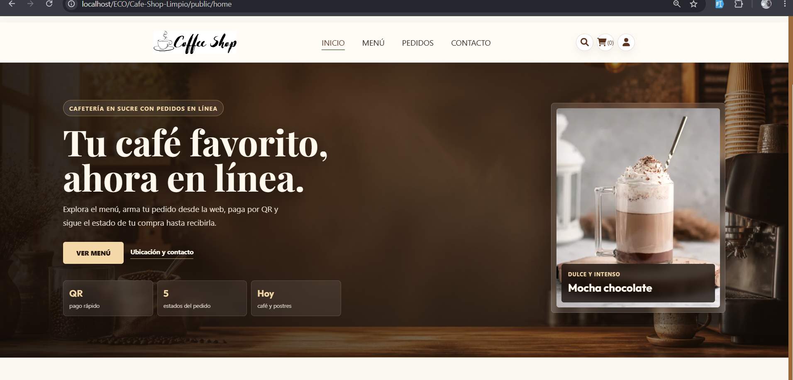
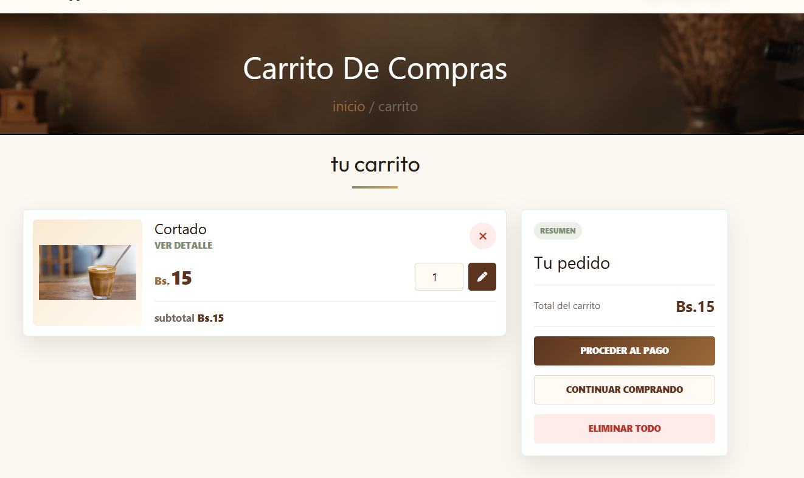
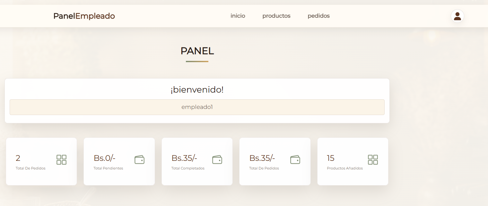
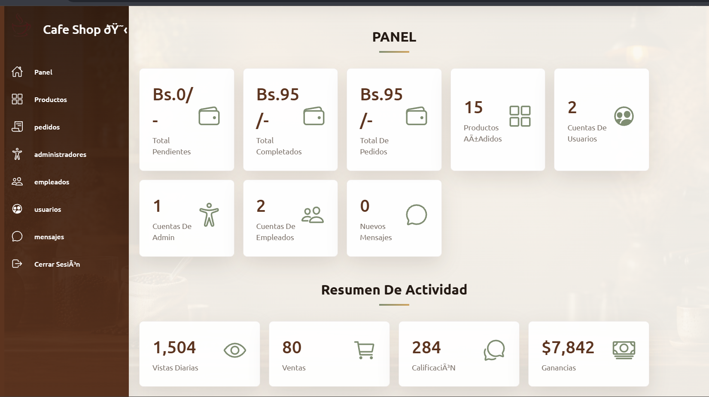

# ☕ Cafeteria Capuchino - Management System

Un sistema web completo para la gestión de pedidos de una cafetería, desarrollado con **PHP, MySQL, HTML, CSS y JavaScript**. Permite a los clientes explorar el menú, realizar pedidos, pagar mediante QR y hacer seguimiento. También incluye paneles exclusivos para administradores y empleados.


## 🚀 Características Principales

### 👤 Para Clientes
- **Catálogo Interactivo**: Búsqueda de productos, categorías y vista rápida.
- **Carrito de Compras**: Gestión de productos antes de realizar la compra (requiere inicio de sesión).
- **Checkout y Pago QR**: Confirmación de pedido con subida de comprobante de pago por código QR.
- **Seguimiento de Pedidos**: Ver el estado actual de los pedidos y el historial de compras.
- **Facturación**: Generación de nota de venta/recibo digital.
- **Gestión de Perfil**: Actualización de datos personales y dirección de entrega.





### 🛡️ Para Administradores y Empleados
- **Dashboard Estadístico**: Resumen de ventas, pedidos pendientes y completados.
- **Gestión de Productos**: Añadir, editar y eliminar productos del menú.
- **Gestión de Pedidos**: Actualizar el estado de los pedidos (Pendiente, En preparación, Completado).
- **Gestión de Usuarios (Solo Admin)**: Administración de cuentas de clientes, empleados y otros administradores.
- **Mensajes**: Bandeja de entrada para consultas de clientes.



## 📂 Arquitectura del Proyecto

El proyecto sigue una estructura simplificada:

```text
cafeteria_pedidos/
├── admin/           # Panel de control exclusivo para administradores
├── components/      # Componentes reutilizables (Header, Footer, etc.)
├── controllers/     # Lógica de las rutas y acciones del cliente
├── employee/        # Panel de control para empleados
├── models/          # Conexión y consultas a la base de datos
├── public/          # Carpeta pública (CSS, JS, Imágenes y vistas del cliente)
├── views/           # Vistas adicionales y plantillas
└── index.php        # Redirección automática a la carpeta public/
```

## 🛠️ Instalación Rápida (Local)

1. **Requisitos**: Instala [XAMPP](https://www.apachefriends.org/es/index.html) e inicia los servicios **Apache** y **MySQL**.
2. **Descarga**: Copia el proyecto dentro de la carpeta `htdocs` de XAMPP (ej. `C:\xampp\htdocs\cafeteria_pedidos`).
   ```bash
   git clone https://github.com/LY-LOPEZ/cafeteria_pedidos.git
   ```
3. **Base de Datos**: 
   - Ve a `http://localhost/phpmyadmin/`
   - Crea una nueva base de datos llamada `food_db`.
   - Importa el archivo `food_db.sql` que viene en la carpeta del proyecto.
4. **Ejecución**: Abre tu navegador y ve a `http://localhost/cafeteria_pedidos/`.

## 🔐 Credenciales de Acceso (Prueba)

Tras importar la base de datos, puedes usar las siguientes credenciales para probar los diferentes roles:

- **Administrador**:
  - URL: `http://localhost/cafeteria_pedidos/admin/admin_login.php`
  - Usuario: `admin` | Contraseña: `admin`
  
- **Empleado**:
  - URL: `http://localhost/cafeteria_pedidos/employee/employee_login.php`
  - Usuario: `empleado1` | Contraseña: `empleado`
  
- **Cliente** (puedes registrar uno nuevo):
  - Correo: `cliente@example.com` | Contraseña: `admin`

## 💻 Tecnologías Utilizadas

- **Backend**: PHP (Vanilla)
- **Base de Datos**: MySQL
- **Frontend**: HTML5, CSS3, JavaScript (Vanilla)
- **Servidor Local**: XAMPP

---
*Desarrollado para la gestión eficiente de cafeterías y sistemas de pedidos en línea.*
